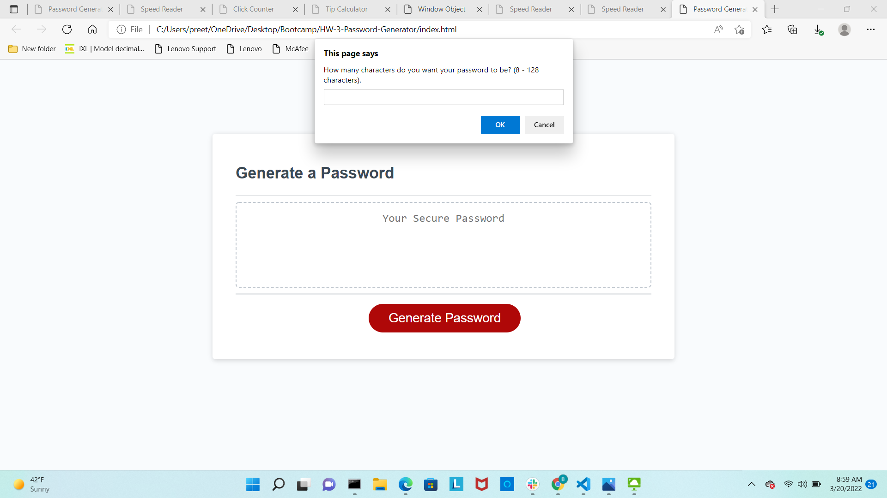
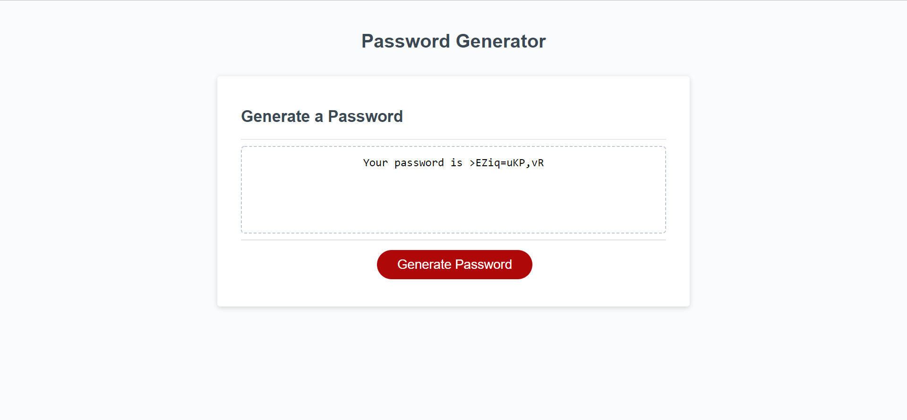

## HW-3-Password-Generator

Generate a random password using javascript only and index.html and styl.css is already given.

## Description

* This is a random password generator project where we have to ask the user critria he needs in his password and on that basis generate a random password string and display it on the screen.

* We have to use different methods like querySelector and addEventListener and window prompt and alert and confirm to get input from the user.

## Expected Goal
* As the user clicks on generate password, the prompt window should ask the user the length of password, weather his password should include uppercase letter,lowercase letter, numbers or special characters.
* If all of the criteria is not met it should tell them that atleast 1 criteria should be met or if a user enters password length out of the range then it should tell them to choose withing the range of 8-128.

## Development Steps
* As the button generate password is clicked, the addEventListener method is called and it calls the writePassword function and starts the complete process.
* Once all the data is gathered from the prompts, it has to go through the conditional statements to create a string of allowed characters.
* Then by using a Math.floor and Math.random, it chooses a random character from that string and adds it in new generated password string. This loop will continue till the length of password chosen.
* And finally that randomly generated password is then showed up on the screen in the browser.

## Screenshots

## Link to the deployed application
https://bhavnao.github.io/HW-3-Password-Generator/

